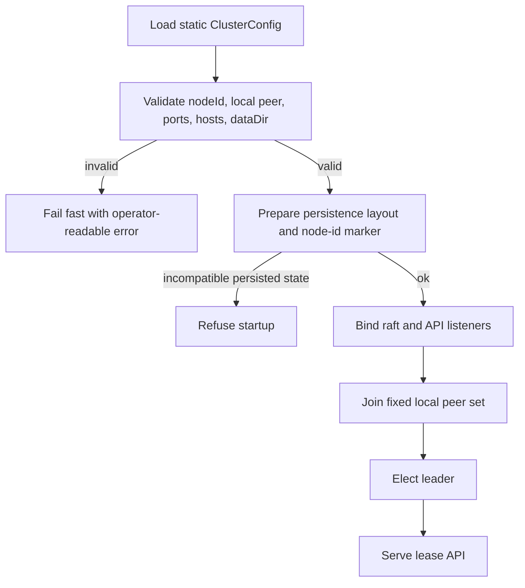
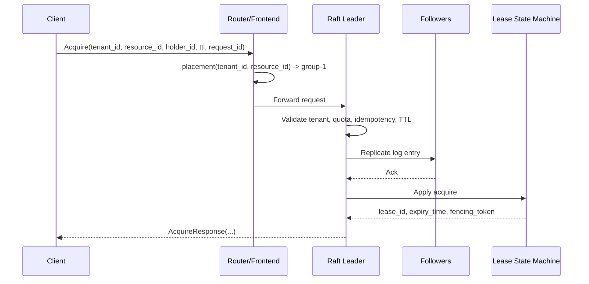
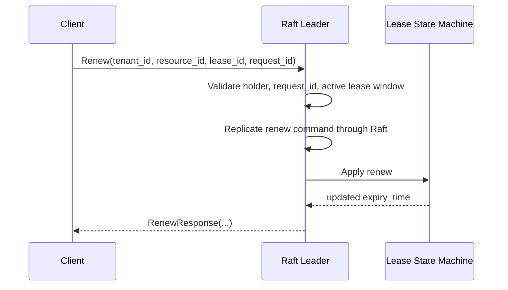
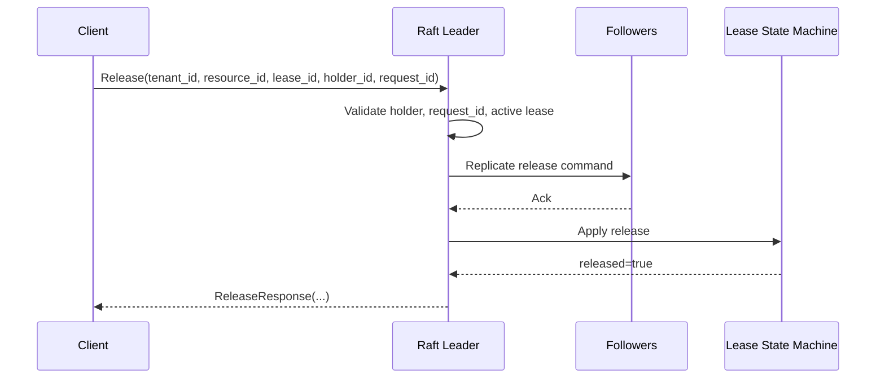
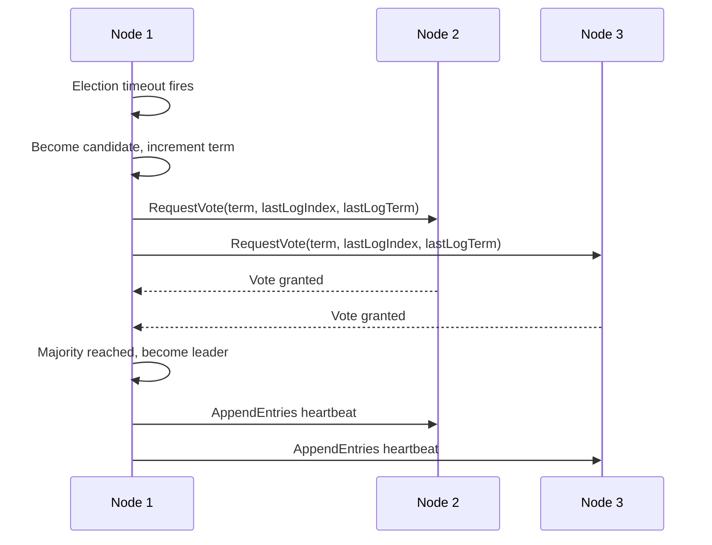
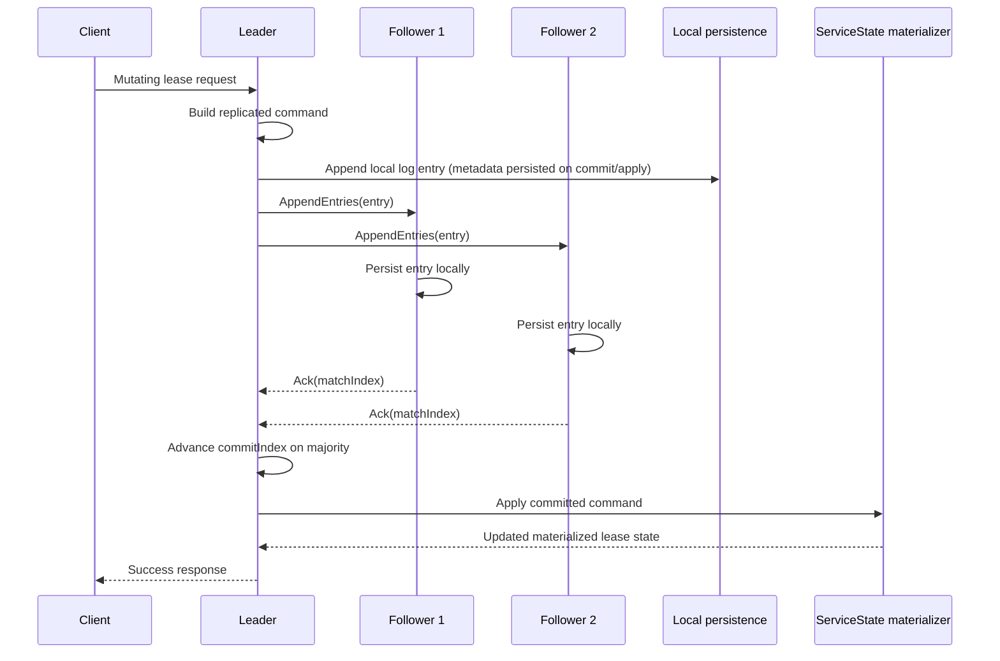
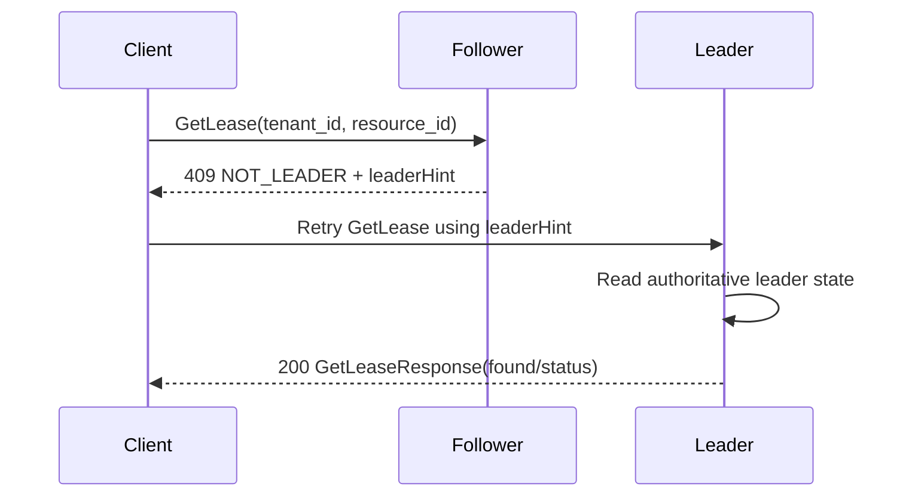
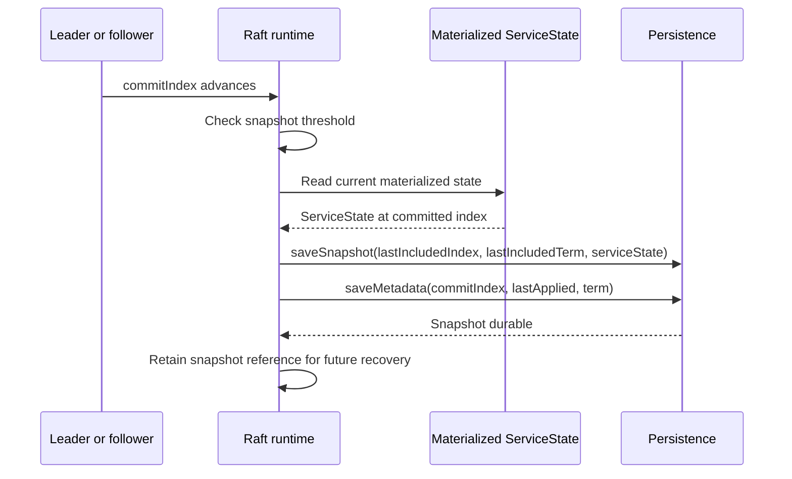
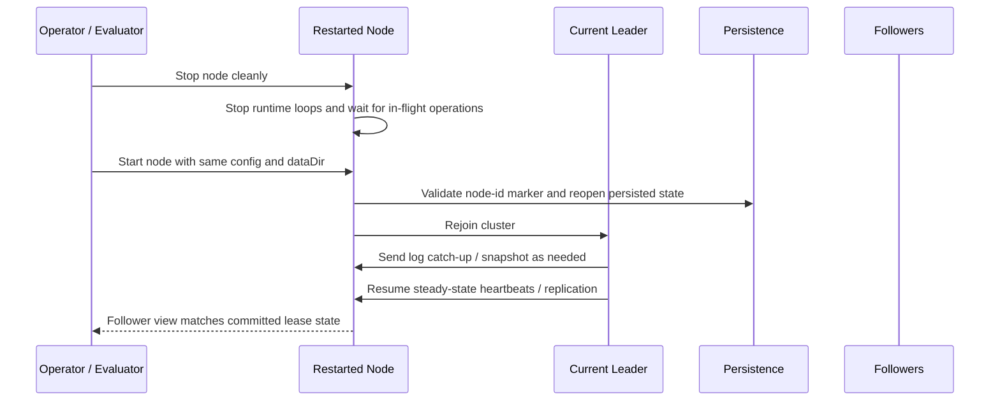
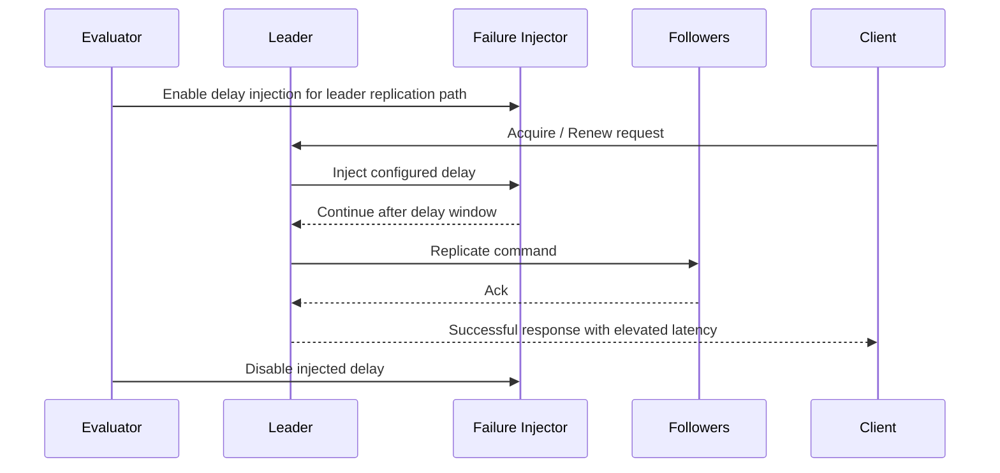

# Request Flow Diagrams

These diagrams are intentionally narrow and v1-specific. They are meant to help reviewers understand the major local flows exercised by the daemon, demo suite, and benchmark harness without reverse-engineering the implementation.

## Clustered startup validation and bootstrap



## v1 Raft and persistence layer overview

```mermaid
flowchart TD
    A[HTTP / service layer] --> B[LeaseService and request validation]
    B --> C[RaftNode leader path]
    C --> D[Replicated log entries]
    D --> E[Committed state-machine apply]
    E --> F[Materialized ServiceState]
    C --> G[Persisted metadata.json]
    D --> H[Persisted log.jsonl]
    E --> I[Occasional persisted snapshot.json (threshold-based)]
    J[node-id marker and dataDir validation] --> G
    J --> H
    J --> I
```

## Acquire request flow



## Renew request flow



## Release request flow



## Leader election overview



## Command replication, commit, and apply



## Follower read rejected with `NOT_LEADER`, then retried



## Snapshot and compaction path



## Clean shutdown and restart recovery



## Recovery bootstrap from snapshot plus committed log

```mermaid
flowchart TD
    A[Open data directory] --> B[Validate node-id marker and file layout]
    B --> C[Load metadata.json]
    C --> D[Load snapshot.json if present]
    D --> E[Load log.jsonl entries]
    E --> F[Choose base state from snapshot or empty ServiceState]
    F --> G[Recover commitIndex = max(snapshot.lastIncludedIndex, persisted metadata.commitIndex)]
    G --> H[Replay committed log entries with index in (snapshot.lastIncludedIndex, commitIndex]]
    H --> I[Set lastApplied = recovered commitIndex]
    I --> J[Node can rejoin as follower and catch up]
```

## Failure-injection delay demo path



## Leader failover and recovery path

```text
client request
    |
    v
old leader fails
    |
    v
remaining quorum elects new leader
    |
    v
new leader replays durable Raft log / snapshot
    |
    v
state machine becomes authoritative again
    |
    v
clients retry with same request_id for idempotent handling
```

## Future routing / placement abstraction

```text
request(tenant_id, resource_id)
           |
           v
placement(tenant_id, resource_id) -> raft_group_id
           |
     +-----+-----+
     |           |
    v1       future
  group-1   group-N
```
