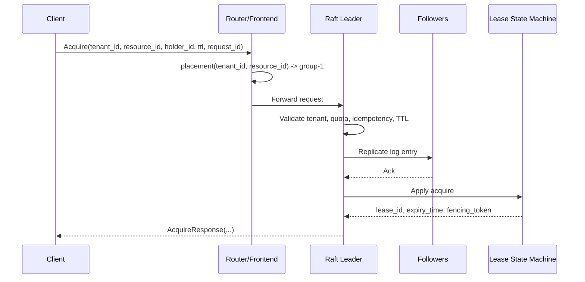
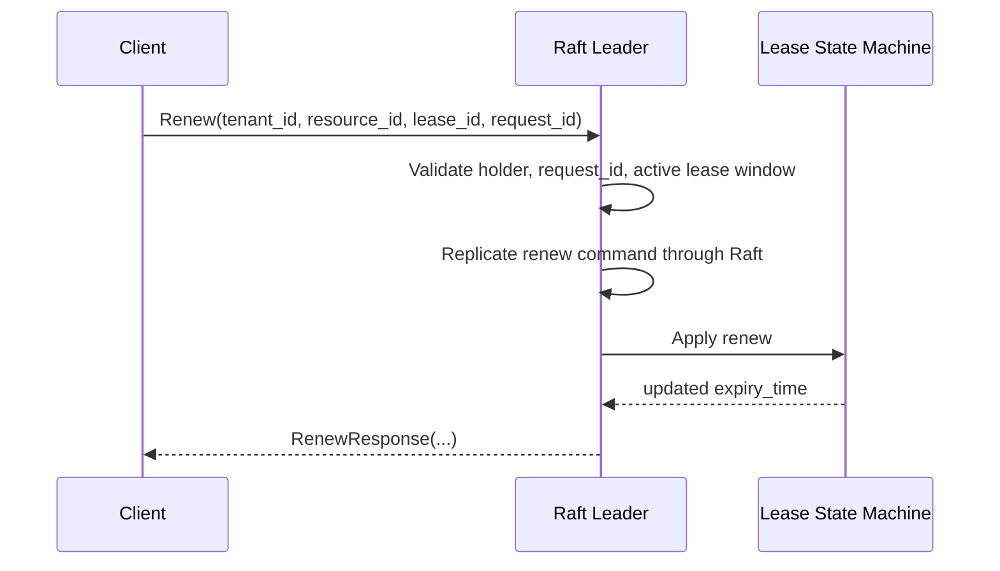

# Request Flow Diagrams

## Acquire request flow



## Renew request flow



## Leader failover and recovery path

```text
client request
    |
    v
old leader fails
    |
    v
remaining quorum elects new leader
    |
    v
new leader replays durable Raft log / snapshot
    |
    v
state machine becomes authoritative again
    |
    v
clients retry with same request_id for idempotent handling
```

## Future routing / placement abstraction

```text
request(tenant_id, resource_id)
           |
           v
placement(tenant_id, resource_id) -> raft_group_id
           |
     +-----+-----+
     |           |
    v1       future
  group-1   group-N
```
